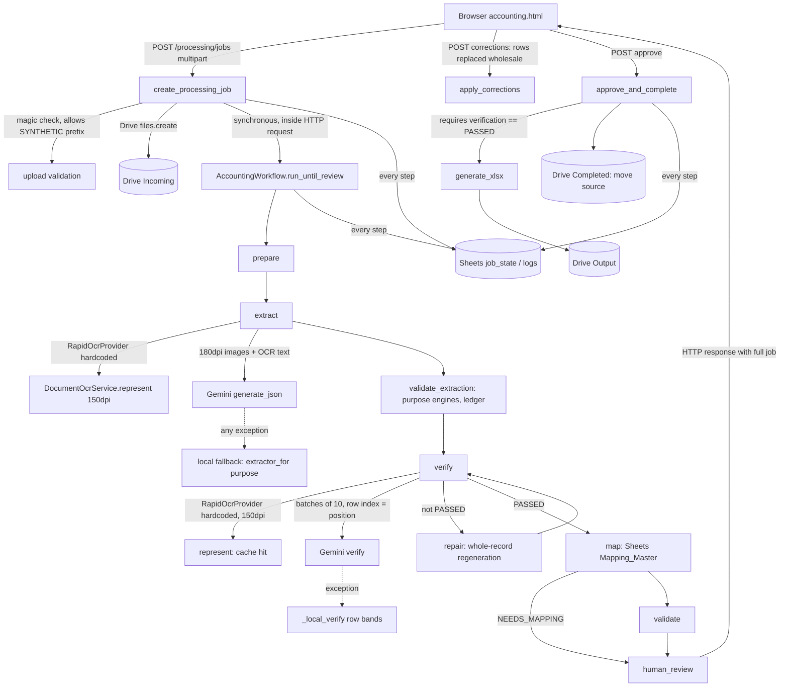

# Production Forensic Audit: NoBrokerHood Accounting AI

| | |
|---|---|
| Audit date | 2026-09-19 |
| Local baseline commit | `bb3575f` (branch `production-accuracy-ux-performance`) plus an uncommitted working tree. The tree is preserved as stash object `f270706f`. |
| Deployed `origin/main` | `b178a95` (merge of PR #6, code `899408d`) |
| Production backend | https://pdftoexcel-846x.onrender.com |
| Production frontend | https://nobrokerhood.github.io/pdftoexcel/ |
| Method | Full read of every runtime path plus runtime traces |

The runtime traces were:
- a per-line OCR dump of the handwritten register;
- a row-anchor trace of `RegisterExtractor._page`;
- live Gemini input and output captures for PETTY_CASH_REGISTER and VENDOR_INVOICE;
- probes of the `_amount()` export function;
- probes of the production endpoints.

No production behaviour was changed while this audit was prepared.

## 1. Production state at audit time (evidence)

| Probe | Result | Meaning |
|---|---|---|
| `GET /health` | 200 after **59.9 s** (cold start) | The instance sleeps. The first upload after idle pays about 60 s before any work starts. |
| `GET /readiness` | 200, `"rapidocr_ready": true` | That value is a **hardcoded constant** (`app_factory.py`, `readiness()`), not a probe. |
| `GET /config/capabilities` | **404** | The capability endpoint is not deployed. Production cannot state which OCR engines it has. |
| Frontend `accounting.html` | contains `truthfulStages` | The fake 7-second progress timer is live in production. |

## 2. Architecture as found

### Runtime call graph (actual)

1. `POST /processing/jobs`: `app/api/processing.py:create_processing_job`
   - extension and MIME check, signature check (**accepts `SYNTHETIC` as a valid PDF/JPEG/PNG signature**), size check, `pdf_page_count`
   - `TemplateRegistryService.get_active_template`, then `FolderRouterService.route` x4 (Sheets `Folder_Config`)
   - `job_repository.create`, a store chosen by config: `GoogleSheetsProcessingJobStore` (memory dict + Sheets mirror)
   - `lifecycle_service.create_row`, which writes the Processing_Log row and the job_state row (Sheets)
   - `GoogleDriveService.upload_file` (`validate_folder_id` + `files.create`, `supportsAllDrives=True`)
   - `accounting_workflow.run_until_review(job)`. This is **synchronous inside the request**; the browser waits for the whole pipeline.
2. LangGraph: `prepare` → `extract` → `verify` → (`repair` → `verify`)* → `map` → `validate` → `human_review` → END
   - `_extract`: `ExtractionAgent.extract` → `GeminiExtractionProvider.extract` → `validate_extraction`
     - `DocumentOcrService.represent`: for PDFs, `PageLevelPdfInspector.inspect_document` (pypdf). Digital pages take the **vector-text bypass with fabricated bboxes**. Scanned pages go to `render_single_page(150dpi)` → `_read_page` (variant A, plus at most one fallback variant, **RapidOCR only**).
     - Prompt selection: a dedicated prompt for MEMBER_RECEIPT; **every other purpose uses the vendor-invoice schema keys**.
     - `load_page_images(dpi=180)` → `gemini_client.generate_json([prompt, *images])`
     - On any exception: `_run_local_fallback`, i.e. `DocumentClassifier` + `extractor_for(purpose)`. MEMBER_RECEIPT → `MemberReceiptExtractor`, PETTY_CASH → `RegisterExtractor`.
     - `validate_extraction(purpose, result)`, a purpose-specific engine: `PettyCashRegisterEngine`, `MemberBankReceiptEngine` or `VendorInvoiceEngine`. It then builds the candidate ledger (post-engine) and runs reconciliation.
   - `_verify`: `VerificationAgent.verify` → `GeminiVerificationProvider.verify`. OCR is rebuilt (cache hit), images are loaded at 150 dpi, then `determine_verification_route` → `_verify_batch` (Gemini). On exception it falls back to `_local_verify`. The guards (`enforce_verification_guards`) run after that.
   - `_repair`: `GeminiRepairProvider.repair`. Gemini regenerates the whole record; the only guard is on row count.
   - `_map`: `MappingMasterService.map_data` (Sheets `Mapping_Master`, 180 s cache)
   - `_validate`: `AccountingValidationService.validate`
   - `_human_review`: sets NEEDS_REVIEW
3. `POST /jobs/{id}/corrections`: `apply_corrections` replaces arbitrary top-level keys (the UI sends the whole `rows` array), then re-runs reconciliation and validation.
4. `POST /jobs/{id}/approve`: `approve_and_complete` requires `verification_status == "PASSED"` and validation PASSED. It then runs `TemplateOutputGenerator.generate_xlsx`, the Drive upload to Output, and a Drive move of the source to Completed.

## 3. Findings

Severity:
- **BLOCKER**: wrong or fabricated accounting output, silent data loss, a security hole, or a production outage mode.
- **HIGH**: a correctness or availability risk under normal use.
- **MEDIUM**: a hardening issue.

Each finding lists its evidence, location, correction and the test that proves the correction.

### A. OCR architecture

| ID | Sev | Finding | Evidence | Location |
|---|---|---|---|---|
| A1 | BLOCKER | **RapidOCR is hardcoded at 3 sites.** PaddleOCR never runs in the pipeline; it is built only by the capability probe and by the unused `OcrRouter`. | `grep RapidOcrProvider(` hits these three sites and nothing else | `app_factory.py:101`, `extractor.py:41`, `verifier.py:121` |
| A2 | BLOCKER | **No common OCR contract.** `RapidOcrProvider.read(image)` and `PaddleOcrProvider.read(image, page_idx, variant)` have different signatures. `OcrEngine` in `ocr_base.py` is used by nobody. Neither returns timing, image dimensions, warnings or line ids. | Signatures in `ocr.py:277` and `ocr_router.py:239` | `ocr.py`, `ocr_router.py`, `ocr_base.py` |
| A3 | BLOCKER | **Alternative OCR evidence is discarded.** `_read_page` keeps one variant's lines and drops the other's. Only the chosen lines survive into `DocumentRepresentation`. | `ocr.py:_read_page` | `ocr.py:506-538` |
| A4 | HIGH | The variant winner is chosen by `len(lines) × mean_conf`, which rewards noise lines. | `ocr.py:520` | `_read_page` |
| A5 | HIGH | **Provenance label bug:** `preprocessing = quality.recommended_variant` is read *after* `quality` was replaced by the fallback's assessment, so it records the fallback's recommendation, not the variant actually used. | `ocr.py:521-523` | `_read_page` |
| A6 | MEDIUM | Variants D and E are unreachable, because `OcrQualityAssessor` only recommends B or C. Variant D upscales 1.5x, so its bboxes would be in a different coordinate space if it ever ran. | `ocr_quality.py`, `preprocessing.py` | |
| A7 | BLOCKER | **Digital-PDF geometry is fabricated:** `bbox=(0, i*25, 800, i*25+20)` and `width=800`. Column and row alignment and the verifier's row bands treat these as real coordinates. | `ocr.py:450-471` | `represent` |
| A8 | BLOCKER | **Gemini and OCR use different coordinate spaces.** OCR renders at 150 dpi (1240 px wide); Gemini gets 180 dpi (1488 px). The OCR block sent to Gemini carries `y0, x0-x1` only (no `y1`, no page size). Verification images are at 150 dpi. | `extractor.py:60,208`, `verifier.py:347,361` | |
| A9 | MEDIUM | `DocumentOcrService.secondary` (Tesseract) is stored but never used for inference. `DEFAULT_TESSERACT_PATHS` are Windows paths. | `ocr.py:40-43,382` | |
| A10 | HIGH | `/readiness` reports `rapidocr_ready: True` unconditionally. | `app_factory.py` `readiness()` | |

**Correction:**
- Add one `OcrProvider` protocol, `read(image, page_idx=None, variant=None) -> OcrResult`, where `OcrResult` carries engine, page, variant, image size, timing, warnings and lines with `line_id`, text, confidence and `bbox`. Both engines implement it.
- Add an `OcrOrchestrator`, the only code that selects providers. It runs RapidOCR and, when routing says so, PaddleOCR, and keeps **every** engine and variant result in an `OcrEvidenceStore` held on the representation.
- The primary line set is chosen by a field-aware quality score, with the scoring recorded. Consumers receive the orchestrator by injection and never build an engine themselves.
- Canonical coordinate space: one render DPI for OCR and Gemini, with page width and height carried everywhere.
- Digital PDFs: real word geometry from `pdfplumber`, flagged `geometry=REAL`; `ESTIMATED` if unavailable.

**Tests:**
- No module outside the orchestrator instantiates an engine (AST scan).
- Both engines return `OcrResult`.
- Evidence retains both engines and all variants.
- A digital PDF yields non-synthetic x positions.
- The Gemini image size equals the OCR page size.
- `/readiness` reflects a real probe.

### B. Candidate construction and row loss

| ID | Sev | Finding | Evidence | Location |
|---|---|---|---|---|
| B1 | BLOCKER | **Rows are anchored only on DATE cells.** A row whose date fails `REGISTER_DATE` has no anchor. Its voucher, amount and narration become `leftovers`, which are **silently discarded** (except receipt amounts). | Handwritten benchmark trace: 27 date anchors; rows 270, 299, 300, 304, 306 and 308 lost (dates `86+0￥-25`, `1504.25`, `1507.25`, `15.0￥.25`, `15.0€.25`, `1604-25`) | `intelligence/extraction.py:736-812` |
| B2 | BLOCKER | **Reference misclassification:** `=84` and `2.0` become SERIAL, and `1296` becomes TEXT. The row survives but loses its reference (284, 287, 296). | same trace | `RegisterExtractor._classify` |
| B3 | BLOCKER | **The candidate ledger starts after the loss.** `source_candidates = len(rows)` counts rows that the row builder already produced, so B1 losses are invisible and the ledger reports "balanced". | `extractor.py:348,469` | `_record_candidate_ledger` |
| B4 | HIGH | `_is_transaction` filters rows without amount/voucher/particulars, with no record kept. | `extraction.py:866-870` | |
| B5 | HIGH | `_page` returns **zero rows** when fewer than 2 dates are found, keeping only a note. | `extraction.py:740-742` | |
| B6 | HIGH | MEMBER_RECEIPT local fallback on a register returns 0 rows, because only the PETTY_CASH purpose routes to `RegisterExtractor`. | Runtime: 0 rows | `extractor.py:_run_local_fallback` |
| B7 | HIGH | `MemberBankReceiptEngine` turns an unreadable amount into **Decimal("0")**, fabricating a zero-value transaction. `"cr" in narration` / `"dr" in narration` match "address", "crane", etc. | `member_bank_receipt_engine.py:95` | |
| B8 | HIGH | `VendorInvoiceEngine` defaults unreadable amounts to **0** and creates a synthetic "Payment to vendor" row from the document total when no items exist. | `vendor_invoice_engine.py` | |
| B9 | HIGH | `PettyCashRegisterEngine` inflows default an unparseable amount to **0**. `Decimal(str.replace(",",""))` fails on `₹1,800/-` and `Rs.900`, so those amounts become None or 0 instead of being parsed. | `petty_cash_register_engine.py:46-51,75-80` | |

**Correction:**
- Add a **source candidate ledger built directly from OCR evidence before any filtering.** Every visual row band (y-clustered OCR lines per page) becomes a candidate with `candidate_id`, page, row region, bbox, raw lines from every engine, field evidence and a classification.
- Row segmentation uses multiple anchors: reference, date, amount, narration, row pitch and column x-clusters. Any band containing a reference-like, amount-like or date-like token in its column survives, with the missing fields as `-`.
- Each candidate ends in exactly one terminal state: ACCEPTED, NEEDS_REVIEW, REJECTED_WITH_REASON, NON_TRANSACTION or UNRESOLVED. The reconciliation equation is enforced by code and tested.
- One shared financial amount parser (see E1).

**Tests:**
- A date-less row is preserved.
- A synthetic register with unreadable dates keeps every row.
- The ledger equation holds over real OCR of the benchmark.
- No engine produces `0` from an unreadable amount.

### C. Gemini extraction contract

| ID | Sev | Finding | Evidence | Location |
|---|---|---|---|---|
| C1 | BLOCKER | **PETTY_CASH_REGISTER is sent the vendor-invoice schema** (`bill_number, cgst_amount, expenses[]`). | `_schema_keys()` returns the vendor keys for every non-MEMBER purpose | `extractor.py:237-249` |
| C2 | BLOCKER | **Response shape is not validated.** Live run 1: Gemini returned a **list**, and `validate_extraction` raised `AttributeError`. Live run 2: it returned a flat 12-column dict, producing **0 rows, `extraction_outcome=None`, no error**, so the whole register silently vanished. | Live captures (STEP 1) | `extractor.py:222-224`, `validate_extraction` |
| C3 | HIGH | A Gemini result that is not a dict is returned unchanged. `res["_extraction_provider"]` is set only for dicts. | `extractor.py:222` | |
| C4 | HIGH | `VendorInvoiceExtraction` drops `_extraction_provider`, so a local vendor run is reported as GEMINI (`_extract` defaults to "GEMINI"). | `schemas.py:69`, `accounting_graph.py:293` | |
| C5 | HIGH | `validate_extraction` copies the first row into top-level fields for MEMBER_RECEIPT. The Excel writer then reuses those fields (see E3). | `extractor.py:414-433` | |
| C6 | MEDIUM | `generate_json` strips code fences and re-parses. There is no size or shape bound. A malformed JSON response is retried as "retryable", which wastes a call. | `gemini_client.py:320-325`, `is_retryable_error` returns True for non-API errors | |

**Correction:**
- Strict pydantic response models per purpose: `MemberReceiptGeminiResponse`, `VendorInvoiceGeminiResponse`, `PettyCashGeminiResponse`.
- A normaliser that accepts exactly the documented equivalents: an object with `rows[]`; a top-level list **only** when the purpose schema is multi-row, recorded as `SHAPE_NORMALIZED:list_to_rows`; and a single-row object only when the purpose permits single-row documents.
- Anything else becomes a structured `ExtractionContractError`. That result is `NEEDS_REVIEW`, keeps its OCR candidates, and is never turned into zero rows.
- A dedicated petty-cash prompt and schema.

**Tests:** list, flat-dict, empty-object, rows-not-list, wrong-type-amount and missing-rows responses, each for every purpose.

### D. Verification and repair

| ID | Sev | Finding | Evidence | Location |
|---|---|---|---|---|
| D1 | BLOCKER | **Default PASSED:** `b_res.get("overall_status", "PASSED")` in the batch path, and `VerificationAgent` sets `"PASSED"` when the key is missing. | `verifier.py:406,445-446` | |
| D2 | BLOCKER | **No row identity.** Gemini field names are free-form (`Amount*` on unnamed.jpg). Batch numbering restarts per batch, and the guard's `row_(\d+)` regex cannot attribute Gemini results to rows. | Live unnamed.jpg capture; `verifier.py:471` | |
| D3 | HIGH | A single-batch Gemini result is returned raw, without `provider` and with no check that every row was covered. Uncovered rows are therefore implicitly accepted. | `verifier.py:370-383` | |
| D4 | MEDIUM | `GeminiVerificationProvider` has a dead first `verify` definition (lines 126-153), shadowed by the second. | `verifier.py` | |
| D5 | BLOCKER | **Repair regenerates the whole record.** Gemini receives the full extraction and returns a complete new one, so values in rows that were never flagged can change. Only a row-count decrease is rejected. | `repair.py:40-53,79-95` | |
| D6 | HIGH | User-edit restoration after repair is **positional**: `repaired_rows[index] = original`. A reordered or merged repair output silently misplaces edits. | `repair.py:98-100` | |
| D7 | HIGH | Repair is prompted with `_schema_keys(purpose)`, so petty cash gets the vendor schema here too (C1). | `repair.py:45` | |

**Correction:**
- Assign an immutable `row_id` (`r_<page>_<candidate>`) and field ids (`<row_id>.<column>`) at candidate construction. They are carried through the NBH rows, verification and repair.
- The verification prompt sends `row_id` and requires it in the response. The adapter maps only by `row_id`: unknown ids are ignored and logged, and uncovered rows are recorded as `UNVERIFIED`. A missing status becomes NEEDS_REVIEW.
- Repair becomes a field-level request `{row_id, field_id, current, evidence, reason, allowed_candidates}`, and the response may only set those field ids. The merge is by `row_id`, and fields with `USER_EDITED` are never touched.

**Tests:**
- A missing overall_status becomes NEEDS_REVIEW.
- An unknown row_id is ignored.
- An uncovered row becomes UNVERIFIED.
- Repair of field X leaves every other field byte-identical.
- A user-edited field survives repair even when the rows are reordered.

### E. Export, normalisation, and fabricated rows

| ID | Sev | Finding | Evidence | Location |
|---|---|---|---|---|
| E1 | BLOCKER | **Amount corruption in the XLSX:** `re.sub(r"[^\d.\-]","",v)`. The same regex is in `reconciliation._parse_num`. | Probed: `Rs.900`→**0.9**; `2500 (105)`→**2500105**; `1.500,00`→**1.5**; `Rs. 1,789/-` stays a string | `output.py:54-64`, `reconciliation.py:6-16` |
| E2 | HIGH | **Mixed date types** in one column: `04-07-25` stays text while `04/07/2025` becomes a date. `%d/%m/%y` is tried, but `-` two-digit years are not. There is no defined output policy. | `output.py:67-78` | |
| E3 | BLOCKER | **Placeholder-row fabrication at export:** when `rows` is empty, the writer builds one row from the top-level fields (`# Single receipt payload`). The generic branch does `rows or [data]`. A vendor invoice with no expenses gets `[{}]`, one fake row. | `output.py:131-142,150,171` | |
| E4 | BLOCKER | **Vendor invoice primary sheet is not the 12 NBH columns.** It uses `template.fields` (bill_number, cgst...). | `output.py:144-166` | |
| E5 | BLOCKER | **Formula injection:** openpyxl writes any string starting with `=` as a formula. Source text such as `=HYPERLINK(...)` or `+cmd` reaches cells unescaped. | `output.py:_clean_str` | |
| E6 | MEDIUM | The Summary sheet reports `Total Transactions = 1` when rows is not a list. | `output.py:199` | |

**Correction:**
- One shared `app/accounting/money.py`:
  - handles `₹`, `Rs.`, `INR`, `/-`, Indian and western grouping, `.00`, and explicit decimal-comma only when unambiguous;
  - reads parentheses as negative only when the whole value is parenthesised;
  - raises AMBIGUOUS on trailing parenthetical notes, mixed separators, multiple numbers or suffix digits;
  - returns `(Decimal|None, status, reason)`.
- One date normaliser with a defined policy: dates are output as the Excel date type `dd-mmm-yyyy` when unambiguous and day-first; otherwise the text is kept and the row is flagged.
- Remove every "build a row from top-level fields" path. Zero rows produce a review-only workbook with no transaction rows, and approval is blocked.
- The primary sheet is always the 12 NBH columns. Vendor detail goes to a supporting sheet.
- Every string cell starting with `=+-@\t\r` gets a `'` prefix.

**Tests:**
- An amount matrix of 30+ inputs.
- A date matrix.
- Empty rows produce no data row.
- The vendor primary sheet has exactly the 12 columns.
- A formula payload is written as text.

### F. Workflow, approval and human review

| ID | Sev | Finding | Evidence | Location |
|---|---|---|---|---|
| F1 | BLOCKER | **NEEDS_REVIEW can never be approved:** `approve_and_complete` requires `verification_status == "PASSED"`. | Radhakrishna E2E returned `409 VERIFICATION_NOT_PASSED` | `accounting_graph.py:420-421` |
| F2 | HIGH | Corrections replace `rows` wholesale with no row identity or per-field diff. User edits are not marked `USER_EDITED` server-side; the UI keeps `_edited_` flags client-side only. | `processing.py:apply_corrections`; `accounting.html saveEdits` | |
| F3 | HIGH | There is no review-item model. Nothing records issue → resolution → user → timestamp → before → after → reason. | | |
| F4 | HIGH | `apply_corrections` swallows reconciliation failures (`except Exception: pass`). | `processing.py:400-401` | |
| F5 | MEDIUM | `route_after_mapping` skips validation when mapping is needed, so the validation status stays NOT_STARTED until approval. | `routing.py` | |
| F6 | HIGH | Mapping rows with an unmapped bank or bill head are placed in `missing`, which **routes to human review with status NEEDS_MAPPING**. Vendor validation makes `expense_code` and `vendor_code` CRITICAL, but `Mapping_Master` is empty, so **every vendor invoice is permanently blocked**. | `validation.py:_vendor_invoice` | |

**Correction:**
- Review items are derived from verification, the ledger, validation and mapping.
- Corrections are per-field PATCHes keyed by `row_id` and field. Each marks `USER_EDITED` and records a before/after audit entry.
- Approval requires:
  - all CRITICAL review items resolved;
  - ledger reconciliation complete;
  - no unresolved mandatory field in exported rows;
  - verification PASSED **or** every non-verified row human-confirmed.
- A missing mapping is a WARNING (it exports the source value), never a blocker.

**Tests:**
- A NEEDS_REVIEW job is approvable after resolution.
- It is not approvable before resolution.
- A correction produces an audit record.
- An unmapped bill head does not block.

### G. Jobs, concurrency, persistence

| ID | Sev | Finding | Evidence | Location |
|---|---|---|---|---|
| G1 | BLOCKER | **The pipeline runs synchronously inside the upload request.** There is no progress, and a long document holds a worker and the browser connection for minutes. | `processing.py:294` | |
| G2 | BLOCKER | **Dockerfile runs `--workers 2` with per-process in-memory jobs and sessions.** A poll or approval landing on the other worker falls back to Sheets state, which may be stale or truncated (G3). Logout revokes a session in one worker only. | `Dockerfile:54`; `stores.py`; `sessions.py` | |
| G3 | BLOCKER | **Sheets job state is truncated at 45 000 characters**, so `json.loads` fails and the loader substitutes a stub with **no extracted_data**. A 29-row job with verification detail exceeds this. | `sheets_service.py:safe_cell_value`; `stores.py:212-223` | |
| G4 | HIGH | `AccountingWorkflow._jobs` and the store's `_jobs` retain every job forever, including **source bytes and output bytes**. This is an unbounded memory leak. | `accounting_graph.py:188,223`; `stores.py` | |
| G5 | HIGH | Every lifecycle update does a Sheets `get_all_values` (read) plus `batch_update` (write), about 10 times per job, plus log writes. This is a quota risk (60 reads per minute per user), and a Sheets failure during a transition is swallowed. | `stores.py:_append_or_update_state` | |
| G6 | HIGH | `update_row_by_key` uses `ValueInputOption.user_entered`, so user-controlled strings (filenames, errors) are **interpreted as Sheets formulas**. | `sheets_service.py:239` | |
| G7 | MEDIUM | The API-usage middleware performs a synchronous Sheets append on **every request**, including unauthenticated ones (when a usage sheet is configured). This is a quota exhaustion vector. | `app_factory.py:api_usage_logger` | |

**Correction:**
- Background execution through a bounded `ThreadPoolExecutor` (a concurrency limit, a per-job timeout). `POST /jobs` returns immediately after upload and the client polls `GET /jobs/{id}`.
- A single process with thread concurrency, so job and session state is authoritative in one process.
- A bounded LRU for completed jobs, releasing source and output bytes after completion (Drive holds the files).
- Job state is persisted to Sheets **compressed** (zlib + base64), chunked across cells if needed and never truncated. A failed load raises instead of returning a stub.
- Sheets writes use RAW input and formula-escaped values.
- The usage middleware writes asynchronously and only for authenticated API calls.

**Tests:**
- A job over 45k characters round-trips.
- A formula-like filename is stored as text.
- The job endpoint returns before processing completes.
- The memory store evicts.

### H. Security

| ID | Sev | Finding | Evidence | Location |
|---|---|---|---|---|
| H1 | BLOCKER | **Test bypass in the production upload path:** the signature checks accept `b"SYNTHETIC"` for PDF, JPEG and PNG. | `processing.py:223,234,237` | |
| H2 | BLOCKER | **Unauthenticated Gemini-spending endpoints:** `/process-document/`, `/export-to-excel/`, `/split-pdf/` and `/kb-query` have no session dependency. | `legacy_tools.py`, `kb/kb_service.py:98` | |
| H3 | HIGH | `/login-log` is unauthenticated, so anyone can append forged rows to the login audit sheet. | `api/audit.py` | |
| H4 | HIGH | There is no decompression-bomb or page-count bound. A 10 MB PDF with hundreds of pages is rendered in full, and PIL's pixel limit is left at its default. | `ingestion.py`, `pdf_images.py` | |
| H5 | MEDIUM | `/test-seed-job` exists in production code. It is gated by `allow_dev_login`, but it fabricates PASSED statuses. | `processing.py:310-348` | |
| H6 | MEDIUM | `Content-Disposition` uses a filename that is unquoted in `download_output`. | `processing.py:521` | |
| H7 | MEDIUM | Drive error messages returned to the client include the folder id and the service-account email. | `format_safe_drive_error` | |

**Correction:**
- Remove the SYNTHETIC acceptance.
- Require a session on all processing and legacy tools. Protect `/login-log` with a session, or remove it.
- Cap PDF pages (`MAX_PDF_PAGES`, default 20) and image pixels.
- Disable `/test-seed-job` when `environment == production`.
- RFC 5987 filenames.
- Return a generic client error and keep the detail in logs.

**Tests:**
- SYNTHETIC upload is rejected.
- The legacy endpoints return 401 without a session.
- An over-limit page count gives 400.
- A pixel bomb is rejected.

### I. Deployment parity

| ID | Sev | Finding | Evidence | Location |
|---|---|---|---|---|
| I1 | BLOCKER | **`render.yaml` and the Dockerfile disagree.** `render.yaml` uses `env: python` with a build command running `apt-get install` (which does not run on Render's native Python runtime), port 10000 and 1 worker. The Dockerfile uses port 8000 and 2 workers. Which one production uses is unverifiable from the repo, and `/readiness` claims poppler is present. | `render.yaml`, `Dockerfile` | |
| I2 | HIGH | Production has no `/config/capabilities` (404) and no deployed-version endpoint, so the deployed commit cannot be verified. | Probe | |
| I3 | HIGH | Memory: the PaddleOCR and paddlepaddle runtime is several hundred MB. Two workers double it. The Render plan limit is unknown to the repo. | | |
| I4 | MEDIUM | The capability endpoint does not probe Drive or Sheets connectivity. | `capabilities.py` | |

**Correction:**
- One deployment definition: `render.yaml` switches to `env: docker` with `dockerfilePath`. The Dockerfile uses `$PORT` and 1 worker.
- `/config/version` returns the git commit (baked at build through a `GIT_COMMIT` build arg, or Render's `RENDER_GIT_COMMIT`).
- `/config/capabilities` adds Drive and Sheets probes (metadata read only).
- PaddleOCR is loaded lazily, with a configurable `OCR_ENSEMBLE` switch so a memory-constrained plan can run DEGRADED honestly.

**Tests:**
- The capabilities output includes drive, sheets and version.
- The capabilities output leaks no secrets.

### J. UI

| ID | Sev | Finding | Evidence | Location |
|---|---|---|---|---|
| J1 | BLOCKER | A fake 7-second rotating progress timer, which is live in production. | `accounting.html:1310-1323` | |
| J2 | HIGH | The UI renders none of: `candidate_ledger`, `unresolved_rows`, rejected candidates, `extraction_notice`, `repair_notice`, provider, per-row evidence. | grep counts: 0 for each | `accounting.html` |
| J3 | HIGH | Client-side row ids are random (`row_i_xxxx`) and not linked to the server's rows. | `renderJob` | |

**Correction:**
- Poll `GET /jobs/{id}` and render the backend `stage_trace`. Remove the timer.
- Add a Review panel: ledger equation, review items with evidence (engines, Gemini, final value, reason), resolve/accept/reject actions, and edited-field marking keyed by the server `row_id`.

### K. Accounting validation and reconciliation

| ID | Sev | Finding | Evidence | Location |
|---|---|---|---|---|
| K1 | HIGH | The closing balance is calculated as `inflows − outflows`, **ignoring the opening balance**. The opening difference compares `abs()` values. | `reconciliation.py:89-108` | |
| K2 | HIGH | Only the closing discrepancy reaches validation. Expenditure and opening discrepancies are computed but never raised as review items. | `validation.py:387-397` | |
| K3 | HIGH | There are no vendor arithmetic checks (line items sum, taxable + GST = total). | `validation.py:_vendor_invoice` | |
| K4 | MEDIUM | Member-receipt single-record validation checks key presence only; `"-"` passes as present. | `validation.py:264-281` | |

**Correction:**
- A deterministic `reconciliation.py` v2 that reports source-written values, calculated values and differences for each of: transaction sum vs written expenditure, inflow sum vs written receipts, and opening + inflows − outflows vs written closing.
- Each discrepancy becomes a **non-blocking, non-correcting** review item.
- Vendor arithmetic checks.

**Tests:** the handwritten fixture reports ₹3 and ₹480 exactly, and no value is altered.

## 4. Remediation order

1. H1, H2, H4, E5, G6: close the security holes (small, independent).
2. E1–E4, B7–B9: one shared money and date layer, and removal of every fabricated row or zero.
3. A1–A8: the OCR contract, orchestrator, evidence store, canonical coordinates, and real PDF geometry.
4. B1–B6: candidate ledger from OCR bands and multi-anchor row segmentation.
5. C1–C6: strict purpose schemas and response normalisation.
6. D1–D7: row_id verification and field-level repair.
7. F1–F6, K1–K4: the review-item model, approval workflow, and reconciliation v2.
8. G1–G5, J1–J3: background jobs, stage trace, state persistence, and UI.
9. I1–I4: deployment parity, the version endpoint, and capabilities.
10. Golden corpus, failure injection, local E2E, deploy, production E2E.
